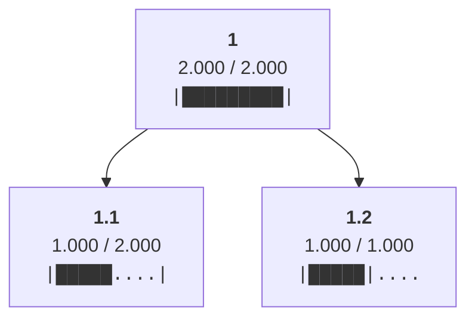
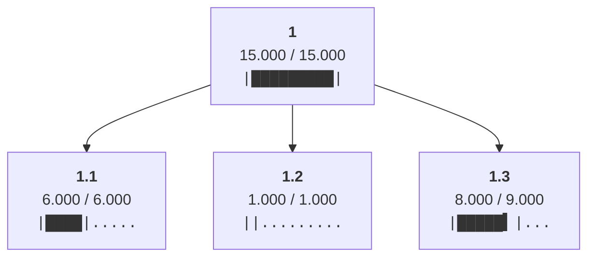
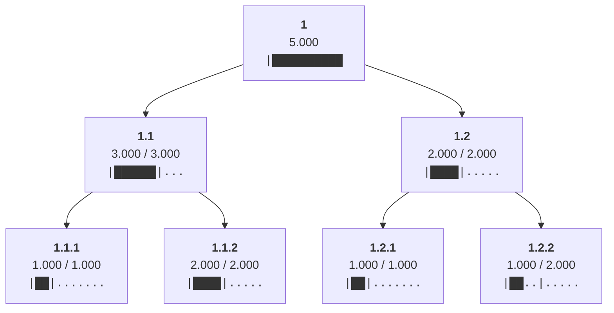
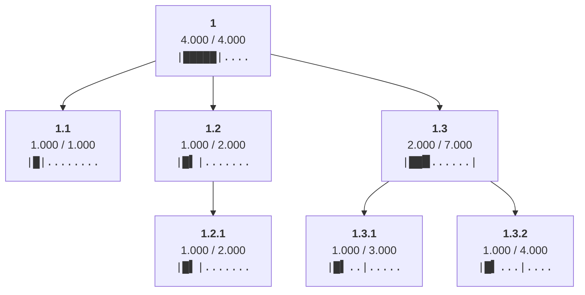
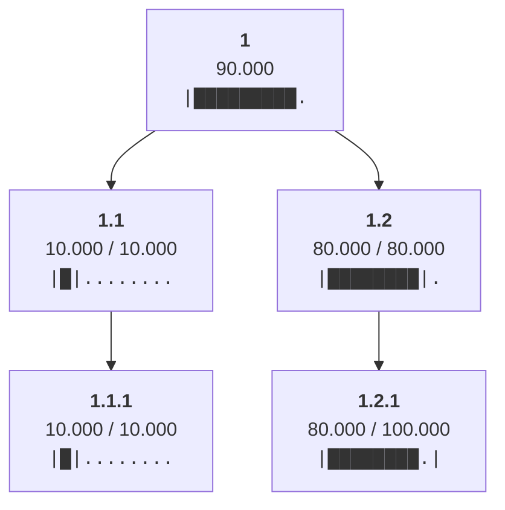
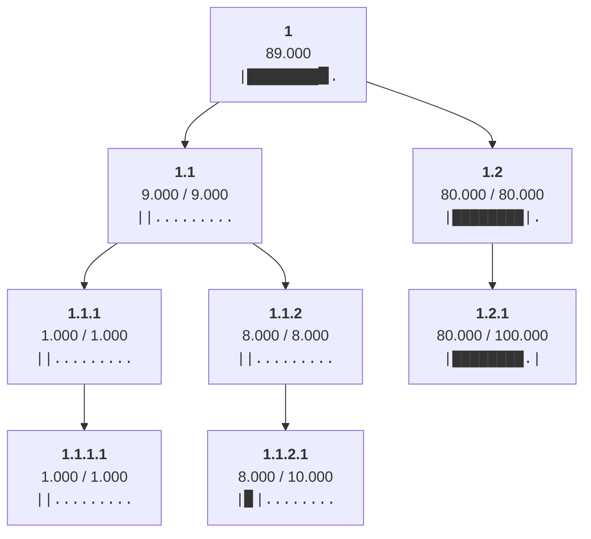

# Examples

Each of the following examples shows a case that the Constrained Node Allocation Balancer algorithm must be able to handle. For simplicity and ease of understanding, they are minimal working examples. Each one corresponds to at least one unit test in the Python package, and links to a full worked example showing the algorithm's step-by-step process.


## Simple case

[Full worked example](full_worked_examples/allocating_to_leaves.md). Unit test: `test_allocating_to_leaves`

This example consists of a simple two-level tree with one root (node 1, with a limit of 2.0 units) and two leaves (nodes 1.1 and 1.2, with limits of 2.0 units and 1.0 units, respectively):

=== "Tree visualization"

    ```mermaid
    flowchart TD
        1["<b>1</b><br>Limit: 2.000"]
        1.1["<b>1.1</b><br>Limit: 2.000"]
        1.2["<b>1.2</b><br>Limit: 1.000"]
        1 --> 1.1
        1 --> 1.2
    ```

=== "Python code"

    ```python
    from constrained_node_allocation_balancer import (
        Node,
        constrained_node_allocation_balancer,
    )

    root = Node(
        limit=2,
        children=[
            Node(limit=2),
            Node(limit=1),
        ],
    )

    constrained_node_allocation_balancer(root)
    ```

The algorithm assigns the largest possible allocations that satisfy the root's limit, while balancing how much is allocated among the leaves:



If the leaves had no limits, or their limits were at least the root's limit, the result would be the same as if the leaves' limits happened to be inactive.

- [Full worked example](full_worked_examples/allocating_to_leaves_without_limits.md). Unit test: `test_allocating_to_leaves_without_limits`

If the root had no limit, or its limit was at least the sum of the leaves' limits, node 1.1 would have been allocated 2.0 units.

- [Full worked example](full_worked_examples/allocating_to_leaves_without_limiting_parent.md). Unit test: `test_allocating_to_leaves_without_limiting_parent`


## Allocating to leaves when redistribution is necessary

### Two-level tree

[Full worked example](full_worked_examples/allocating_to_leaves_when_redistribution_is_necessary.md). Unit test: `test_allocating_to_leaves_when_redistribution_is_necessary`

=== "Tree visualization"

    ```mermaid
    flowchart TD
        1["<b>1</b><br>Limit: 15.000"]
        1.1["<b>1.1</b><br>Limit: 6.000"]
        1.2["<b>1.2</b><br>Limit: 1.000"]
        1.3["<b>1.3</b><br>Limit: 9.000"]
        1 --> 1.1
        1 --> 1.2
        1 --> 1.3
    ```

=== "Python code"

    ```python
    from constrained_node_allocation_balancer import (
        Node,
        constrained_node_allocation_balancer,
    )

    root = Node(
        limit=15,
        children=[
            Node(limit=6),
            Node(limit=1),
            Node(limit=9),
        ],
    )
    constrained_node_allocation_balancer(root)
    ```

The above tree has a root allocation of 15.0 units. At first, the algorithm give an initial allocation of (15.0&nbsp;units)/(3&nbsp;nodes)&nbsp;=&nbsp;5.0 units to each of the three leaf nodes. Node 1.1's and node 1.3's initial allocations do *not* exceed those nodes' limits. However, node 1.2's initial allocation *does* exceed its limit, by 4.0 units. The algorithm will redistribute this excess among the node's siblings that have *headroom* (limit&nbsp;&minus;&nbsp;allocation), allocating 2.0 more units to each of nodes 1.1 and 1.3. As a result, node 1.1's allocation will end up exceeding its limit by 1.0 unit. This excess will be redistributed among node 1.1's remaining siblings that have headroom (in this case, only node 1.3). The algorithm has thereby assigned the largest possible allocations that satisfy the root’s limit, while balancing how much is allocated among the leaves:



### Three-level tree

[Full worked example](full_worked_examples/allocating_to_leaves_when_redistribution_is_necessary_2.md). Unit test: `test_allocating_to_leaves_when_redistribution_is_necessary_2`

=== "Tree visualization"

    ```mermaid
    flowchart TD
        1["<b>1</b><br>Limit: Inf"]
        1.1["<b>1.1</b><br>Limit: Inf"]
        1.1.1["<b>1.1.1</b><br>Limit: 1.000"]
        1.1.2["<b>1.1.2</b><br>Limit: 2.000"]
        1.2["<b>1.2</b><br>Limit: 2.000"]
        1.2.1["<b>1.2.1</b><br>Limit: 1.000"]
        1.2.2["<b>1.2.2</b><br>Limit: 2.000"]
        1 --> 1.1
        1.1 --> 1.1.1
        1.1 --> 1.1.2
        1 --> 1.2
        1.2 --> 1.2.1
        1.2 --> 1.2.2
    ```

=== "Python code"

    ```python
    from constrained_node_allocation_balancer import (
        Node,
        constrained_node_allocation_balancer,
    )

    root = Node(
        children=[
            Node(
                children=[
                    Node(limit=1),
                    Node(limit=2),
                ],
            ),
            Node(
                limit=2,
                children=[
                    Node(limit=1),
                    Node(limit=2),
                ],
            ),
        ],
    )
    constrained_node_allocation_balancer(root)
    ```

Result:




## Allocating to leaves in proportion to the number of leaves at or below

[Full worked example](full_worked_examples/allocating_to_leaves_in_proportion_to_n_leaves_at_or_below.md). Unit test: `test_allocating_to_leaves_in_proportion_to_n_leaves_at_or_below`

This example shows how the algorithm does not allocate to nodes evenly, but in proportion to the number of leaves represented by each node. Node 1.1 represents one leaf (because it is a leaf), node 1.2 represents one leaf (because it has one child node that is a leaf), and node 1.3 represents two leaves (because it has two child nodes that are leaves). Rather than splitting the root allocation of 4.0 units evenly and giving each of these three nodes 1.333 units, the algorithm splits the root allocation in proportion to the number of leaves "at or below".

=== "Tree visualization"

    ```mermaid
    flowchart TD
        1["<b>1</b><br>Limit: 4.000"]
        1.1["<b>1.1</b><br>Limit: 1.000"]
        1.2["<b>1.2</b><br>Limit: Inf"]
        1.2.1["<b>1.2.1</b><br>Limit: 2.000"]
        1.3["<b>1.3</b><br>Limit: Inf"]
        1.3.1["<b>1.3.1</b><br>Limit: 3.000"]
        1.3.2["<b>1.3.2</b><br>Limit: 4.000"]
        1 --> 1.1
        1 --> 1.2
        1.2 --> 1.2.1
        1 --> 1.3
        1.3 --> 1.3.1
        1.3 --> 1.3.2
    ```

=== "Python code"

    ```python
    from constrained_node_allocation_balancer import (
        Node,
        constrained_node_allocation_balancer,
    )

    root = Node(
        limit=4,
        children=[
            Node(limit=1),
            Node(
                children=[
                    Node(limit=2),
                ]
            ),
            Node(
                children=[
                    Node(limit=3),
                    Node(limit=4),
                ]
            ),
        ],
    )
    constrained_node_allocation_balancer(root)
    ```

Result:



The same principle applies when redistribution is necessary: [Full worked example](full_worked_examples/reallocating_to_leaves_in_proportion_to_n_leaves_at_or_below.md). Unit test: `test_reallocating_to_leaves_in_proportion_to_n_leaves_at_or_below`


## Allocating to leaves when adjusting an inactive limit(s) is necessary

### Three-level tree

[Full worked example](full_worked_examples/allocating_to_leaves_when_adjusting_inactive_limit_is_necessary.md). Unit test: `test_allocating_to_leaves_when_adjusting_inactive_limit_is_necessary`

As part of its functioning, the algorithm adjusts the limits of any nodes that do not have limits or whose limits can never be reached due to the limits of those node's children. Such nodes' limits are referred to as inactive limits. The following tree has a root allocation of 90.0 units, meaning that the initial allocation to nodes 1.1 and 1.2 would be 45.0 units each. The resulting excess that must be redistributed, however, must be (45.0&nbsp;&minus;&nbsp;10.0)&nbsp;=&nbsp;35.0 rather than (45.0&nbsp;&minus;&nbsp;20.0)&nbsp;=&nbsp;25.0 in order to take into account the limits of child node 1.1.1 and sibling node 1.2. To achieve this, node 1.1's limit is adjusted from 20.0 to 10.0. Similarly, the root node's limit is adjusted from infinity to 90.0.

=== "Tree visualization"

    ```mermaid
    flowchart TD
        1["<b>1</b><br>Limit: Inf"]
        1.1["<b>1.1</b><br>Limit: 20.000"]
        1.1.1["<b>1.1.1</b><br>Limit: 10.000"]
        1.2["<b>1.2</b><br>Limit: 80.000"]
        1.2.1["<b>1.2.1</b><br>Limit: 100.000"]
        1 --> 1.1
        1.1 --> 1.1.1
        1 --> 1.2
        1.2 --> 1.2.1
    ```

=== "Python code"

    ```python
    from constrained_node_allocation_balancer import (
        Node,
        constrained_node_allocation_balancer,
    )

    root = Node(
        children=[
            Node(
                limit=20,  # Inactive limit; will be adjusted to `10`.
                children=[Node(limit=10)],
            ),
            Node(
                limit=80,  # Active limit.
                children=[Node(limit=100)],
            ),
        ],
    )
    constrained_node_allocation_balancer(root)
    ```

Result:



### Four-level tree

[Full worked example](full_worked_examples/allocating_to_leaves_when_adjusting_inactive_limits_is_necessary.md). Unit test: `test_allocating_to_leaves_when_adjusting_inactive_limits_is_necessary`

=== "Tree visualization"

    ```mermaid
    flowchart TD
        1["<b>1</b><br>Limit: Inf"]
        1.1["<b>1.1</b><br>Limit: 9.000"]
        1.1.1["<b>1.1.1</b><br>Limit: 1.000"]
        1.1.1.1["<b>1.1.1.1</b><br>Limit: 1.000"]
        1.1.2["<b>1.1.2</b><br>Limit: 8.000"]
        1.1.2.1["<b>1.1.2.1</b><br>Limit: 10.000"]
        1.2["<b>1.2</b><br>Limit: 80.000"]
        1.2.1["<b>1.2.1</b><br>Limit: 100.000"]
        1 --> 1.1
        1.1 --> 1.1.1
        1.1.1 --> 1.1.1.1
        1.1 --> 1.1.2
        1.1.2 --> 1.1.2.1
        1 --> 1.2
        1.2 --> 1.2.1
    ```

=== "Python code"

    ```python
    from constrained_node_allocation_balancer import (
        Node,
        constrained_node_allocation_balancer,
    )

    root = Node(
        children=[
            Node(
                limit=20,  # Inactive limit; will be adjusted to `10`.
                children=[
                    Node(
                        limit=2,  # Inactive limit; will be adjusted to `1`.
                        children=[Node(limit=1)],
                    ),
                    Node(
                        limit=8,  # Active limit.
                        children=[Node(limit=10)],
                    ),
                ],
            ),
            Node(
                limit=80,  # Active limit.
                children=[Node(limit=100)],
            ),
        ],
    )
    constrained_node_allocation_balancer(root)
    ```

Result:


