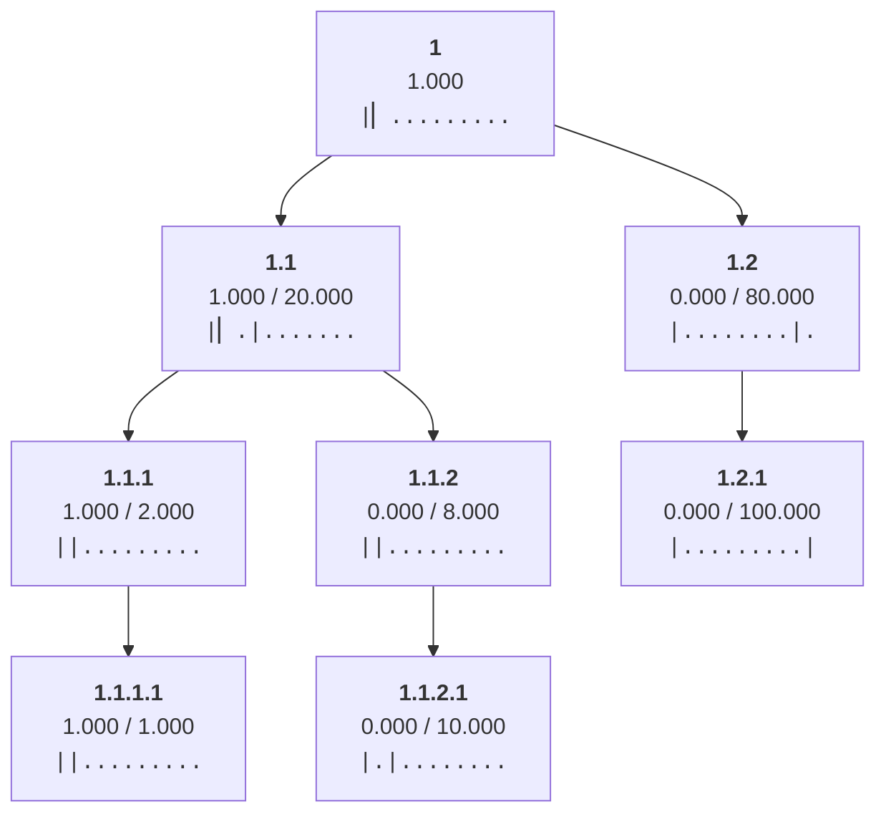
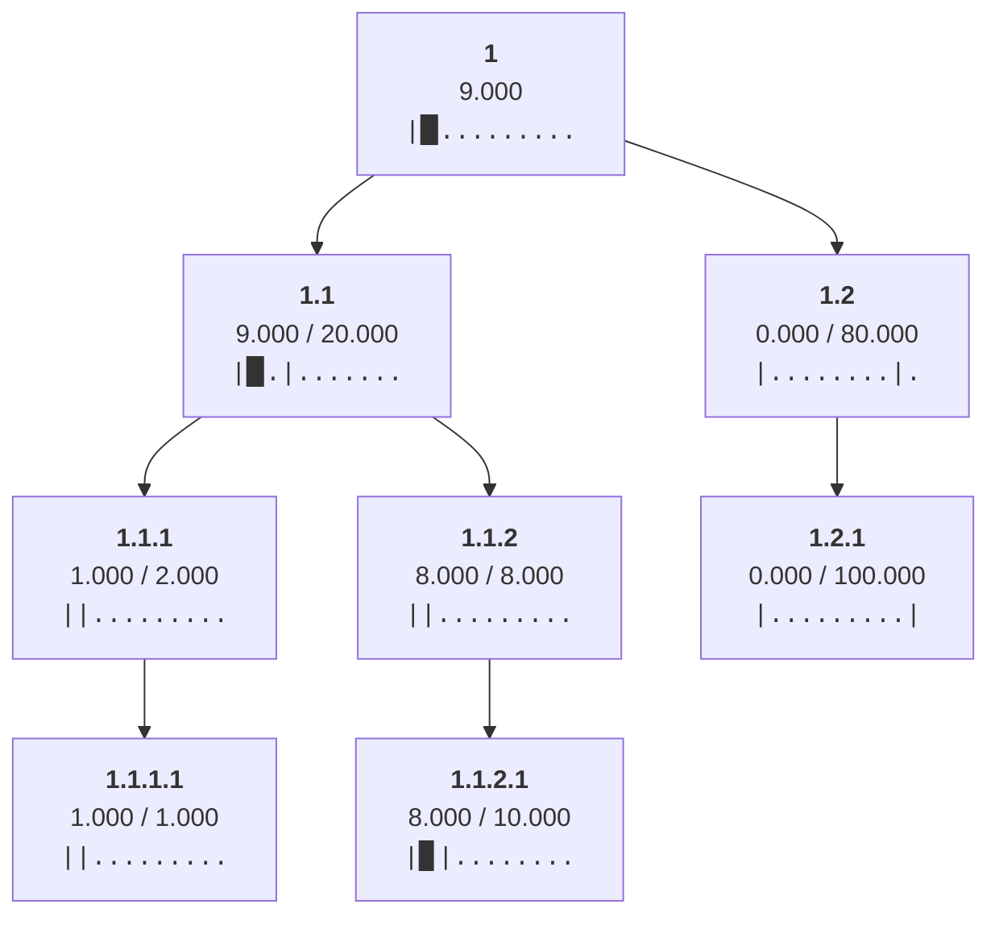
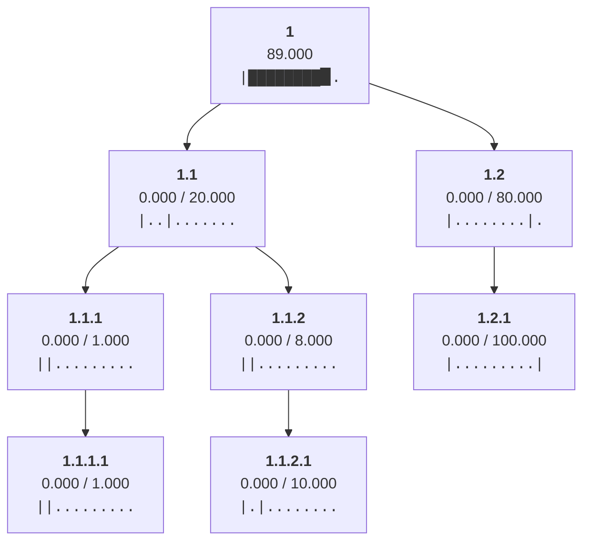
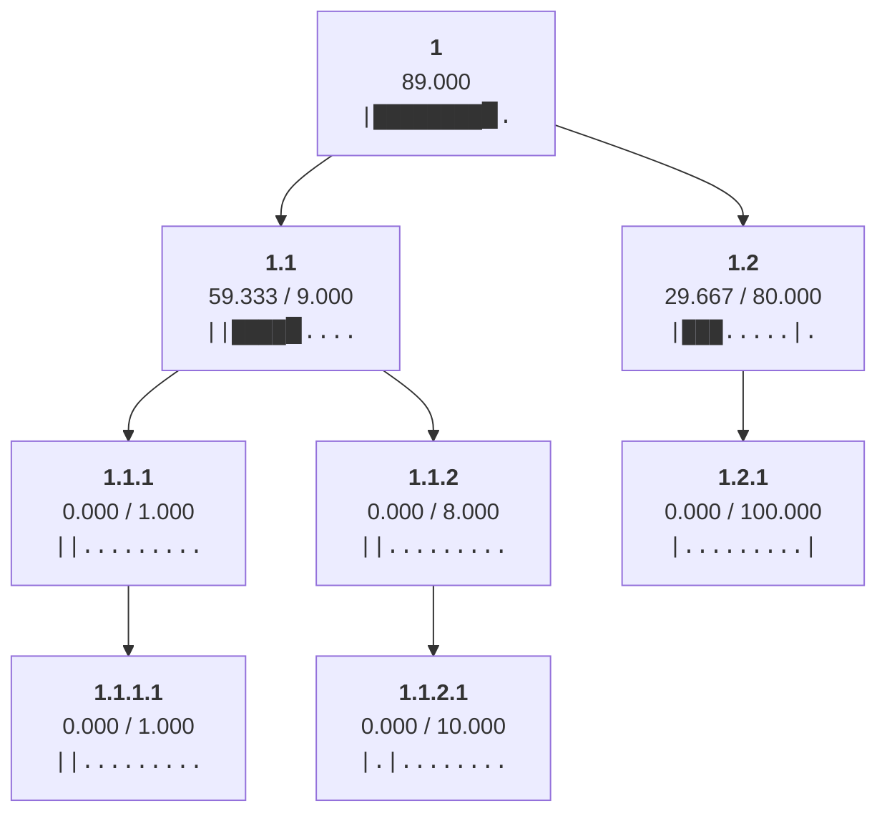
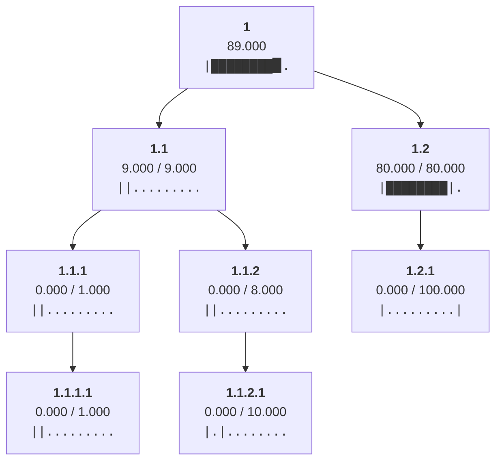
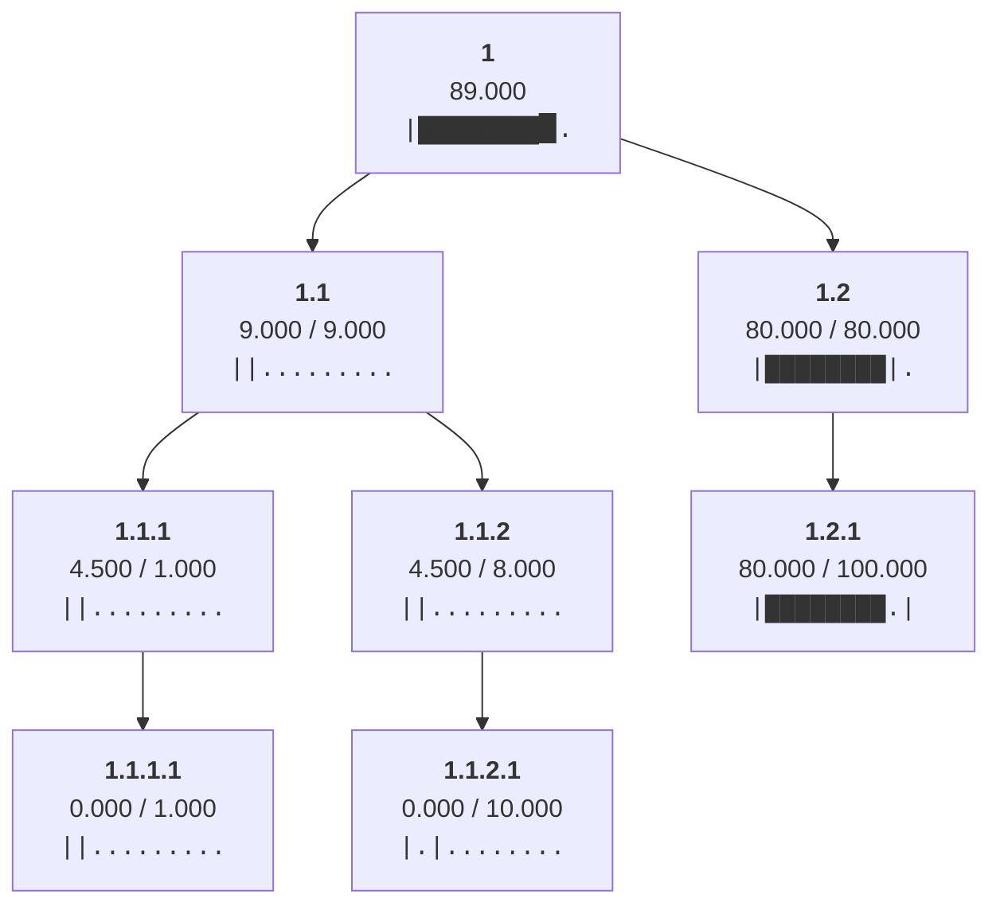
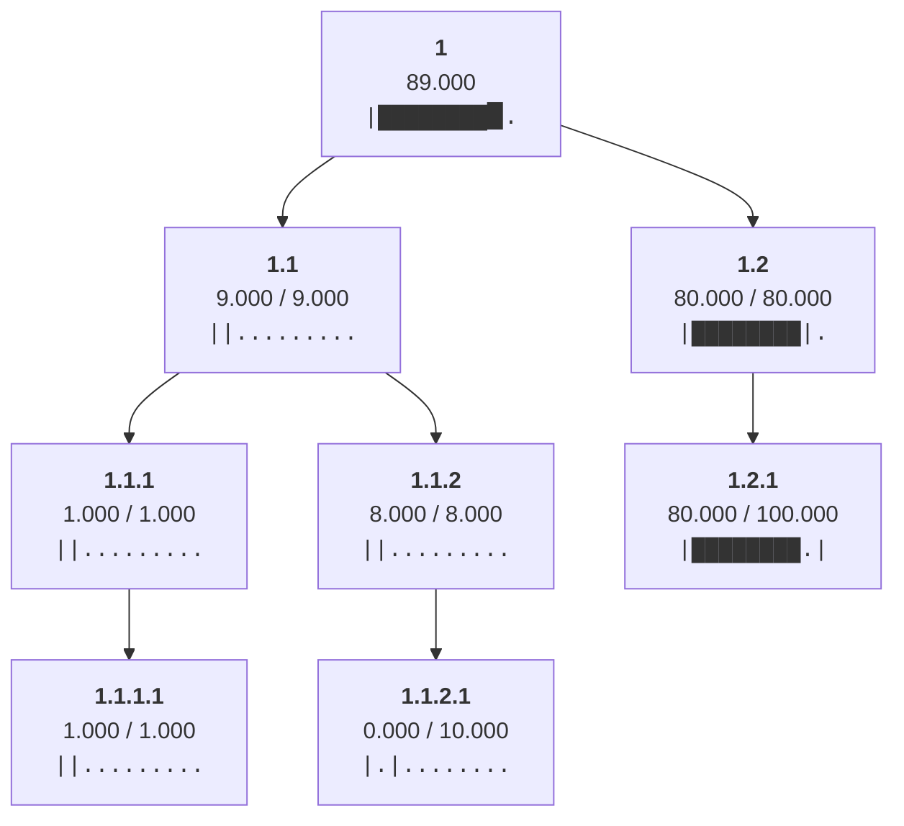
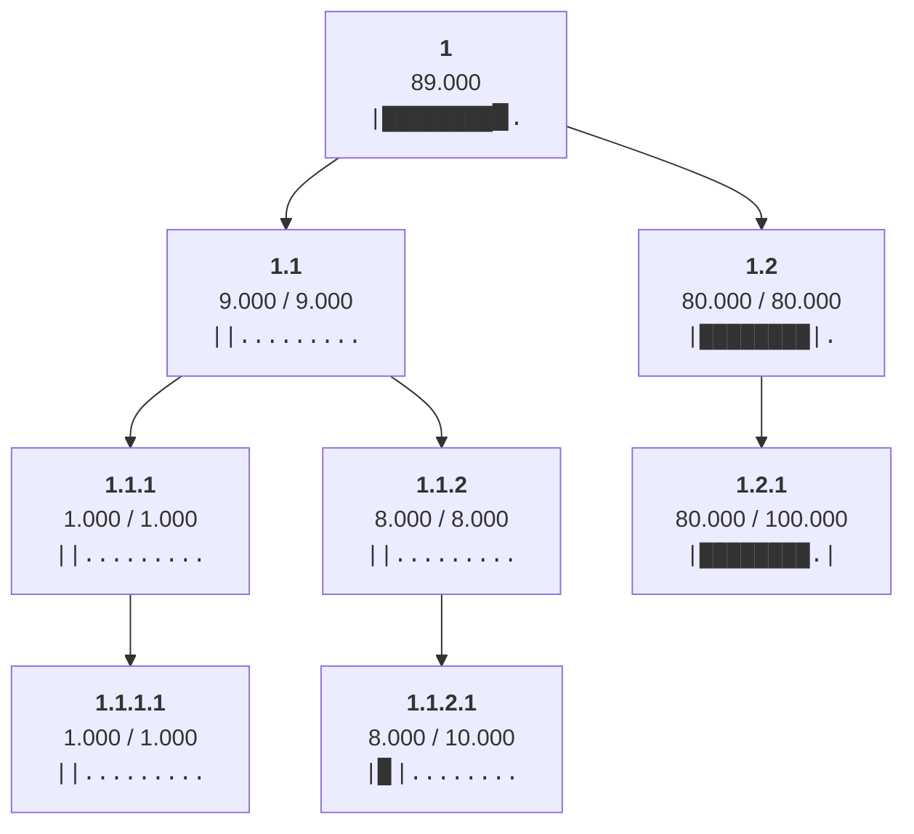

Allocated min(ancestral_budgets) = 1.0 to leaf 1.1.1.1

Allocated min(ancestral_budgets) = 8.0 to leaf 1.1.2.1

Allocated min(ancestral_budgets) = 80.0 to leaf 1.2.1

Cleared allocations from all non-root nodes

Set limit of node 1.1.1 to the sum of its children's limits 1

Set limit of node 1.1 to the sum of its children's limits 9

Distributed 89.0 from node 1 to children ['1.1', '1.2']

Redistributed 50.333333333333336 from node 1.1 to siblings with headroom ['1.2']

Distributed 9.0 from node 1.1 to children ['1.1.1', '1.1.2']

Distributed 80.0 from node 1.2 to children ['1.2.1']

Redistributed 3.5 from node 1.1.1 to siblings with headroom ['1.1.2']

Distributed 1.0 from node 1.1.1 to children ['1.1.1.1']

Distributed 8.0 from node 1.1.2 to children ['1.1.2.1']

