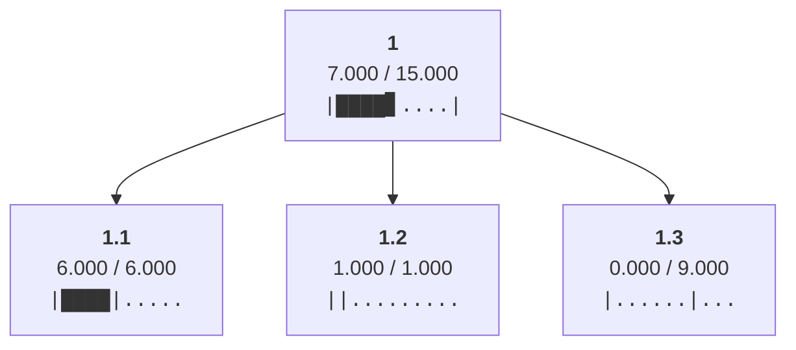
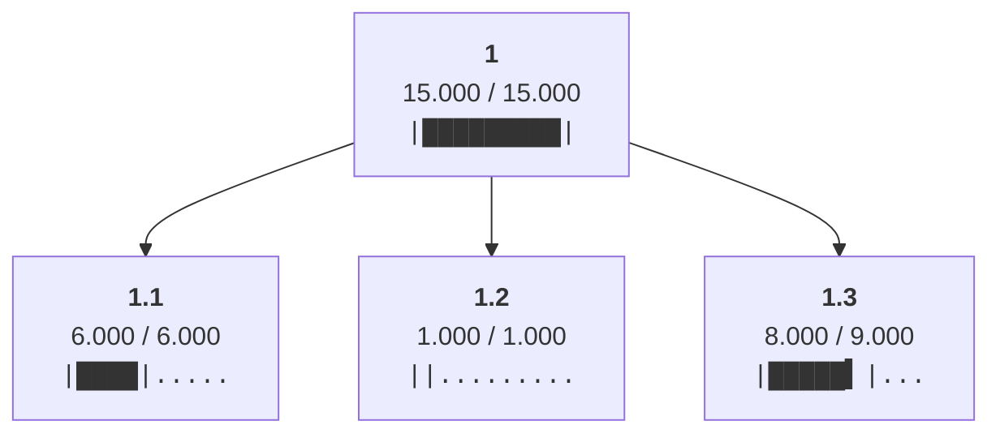
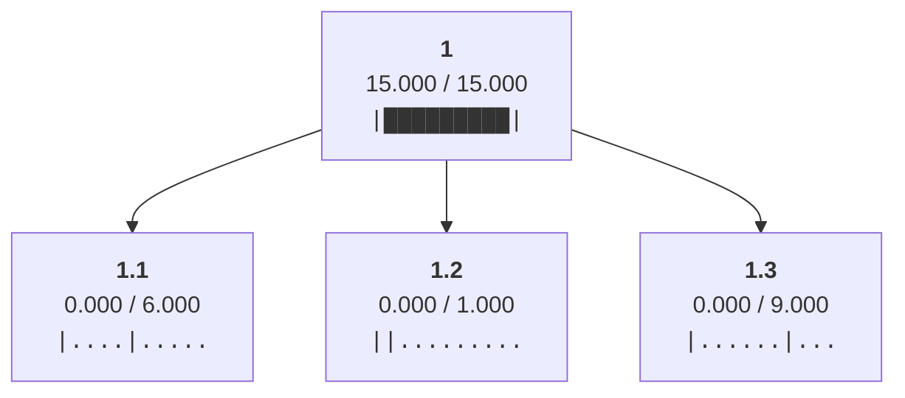
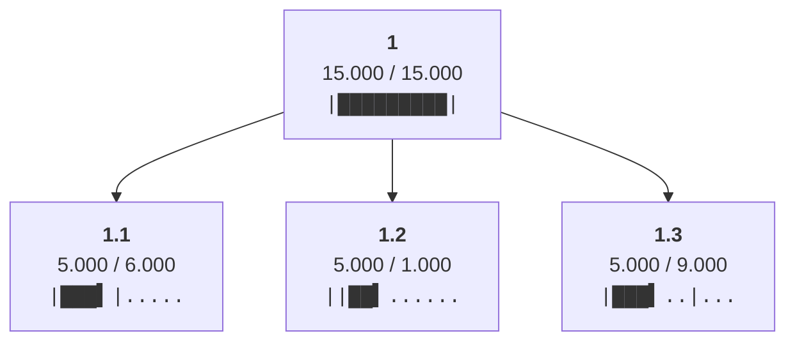
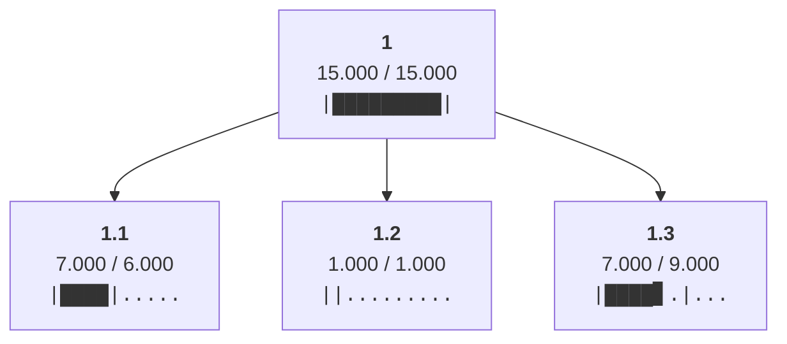

Allocated min(ancestral_budgets) = 6.0 to leaf 1.1

Allocated min(ancestral_budgets) = 1.0 to leaf 1.2

Allocated min(ancestral_budgets) = 8.0 to leaf 1.3

Cleared allocations from all non-root nodes

Distributed 15.0 from node 1 to children ['1.1', '1.2', '1.3']

Redistributed 4.0 from node 1.2 to siblings with headroom ['1.1', '1.3']

Redistributed 1.0 from node 1.1 to siblings with headroom ['1.3']

