Allocated min(ancestral_budgets) = 1.0 to leaf 1.1.1

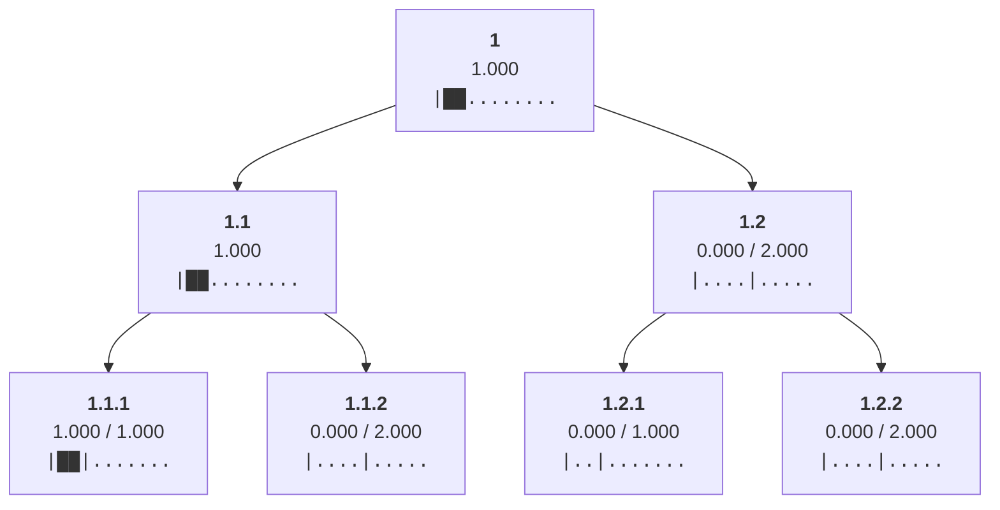

Allocated min(ancestral_budgets) = 2.0 to leaf 1.1.2

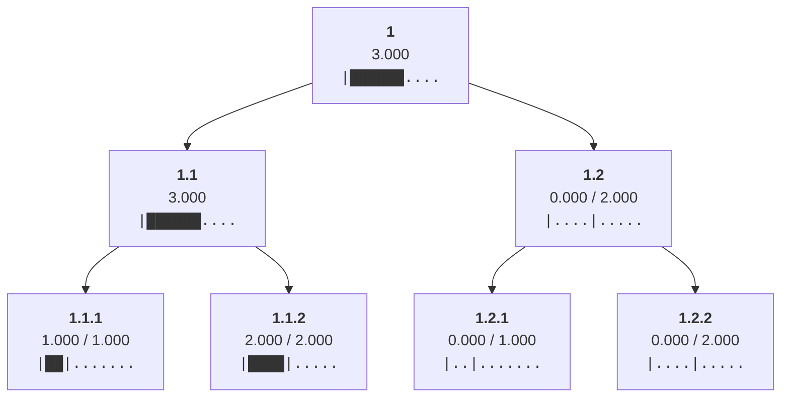

Allocated min(ancestral_budgets) = 1.0 to leaf 1.2.1

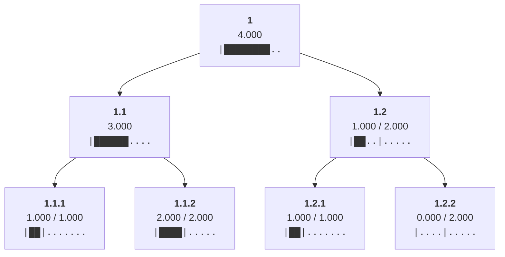

Allocated min(ancestral_budgets) = 1.0 to leaf 1.2.2

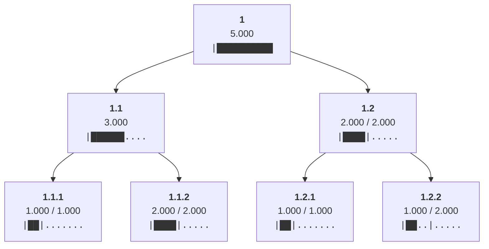

Cleared allocations from all non-root nodes

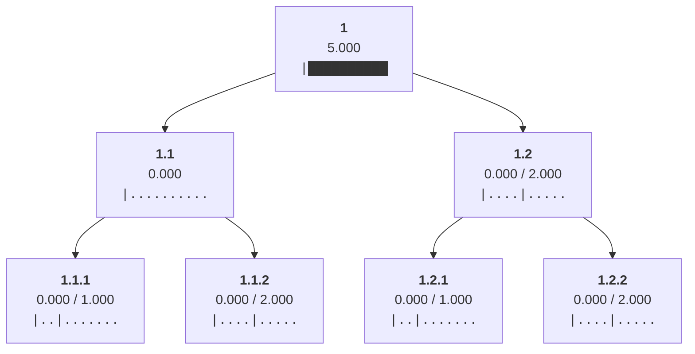

Set limit of node 1.1 to the sum of its children's limits 3

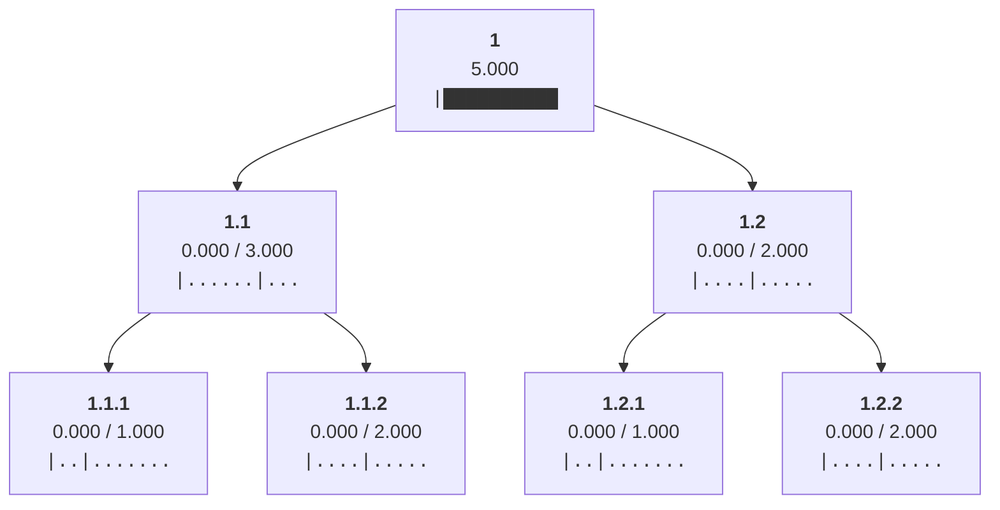

Distributed 5.0 from node 1 to children ['1.1', '1.2']

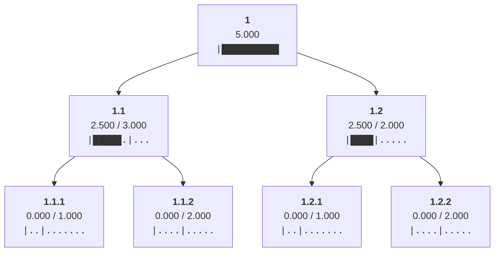

Redistributed 0.5 from node 1.2 to siblings with headroom ['1.1']

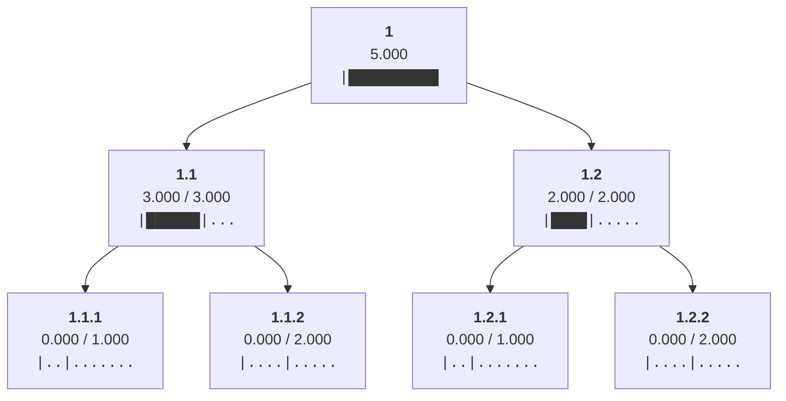

Distributed 3.0 from node 1.1 to children ['1.1.1', '1.1.2']

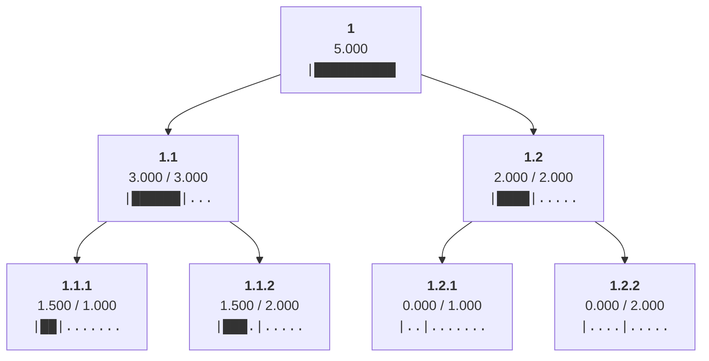

Distributed 2.0 from node 1.2 to children ['1.2.1', '1.2.2']

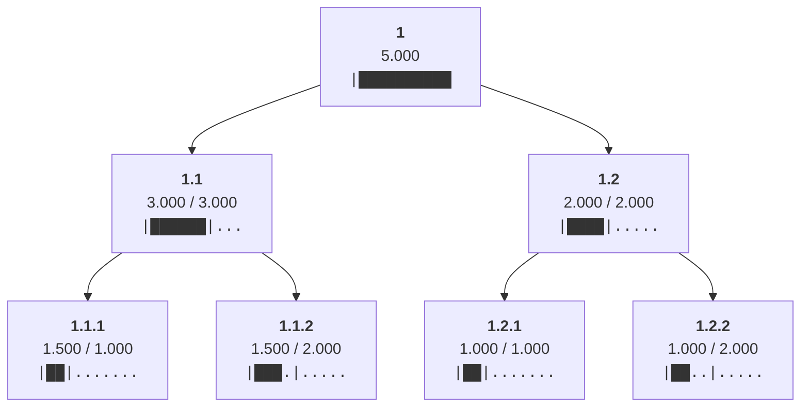

Redistributed 0.5 from node 1.1.1 to siblings with headroom ['1.1.2']

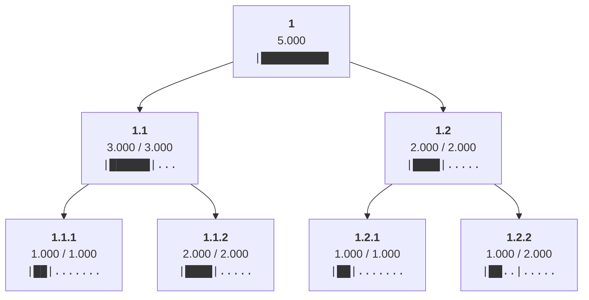

