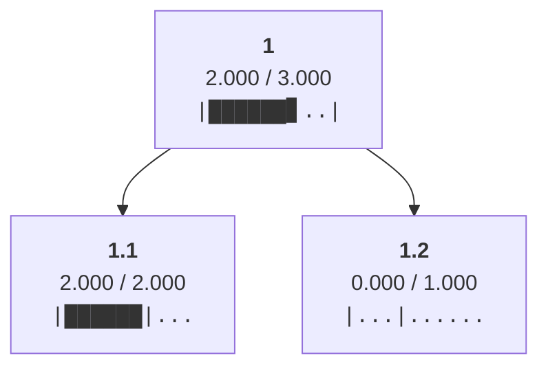
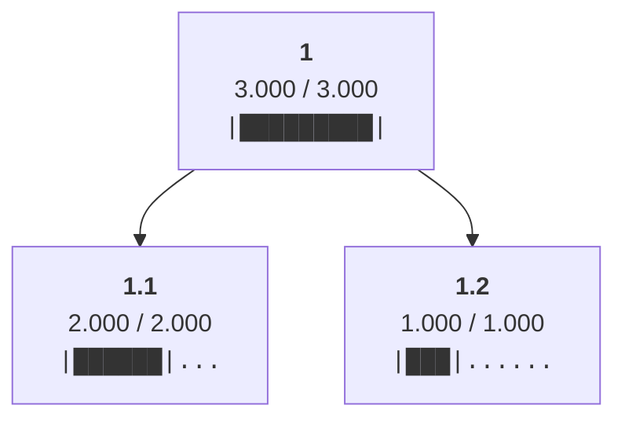
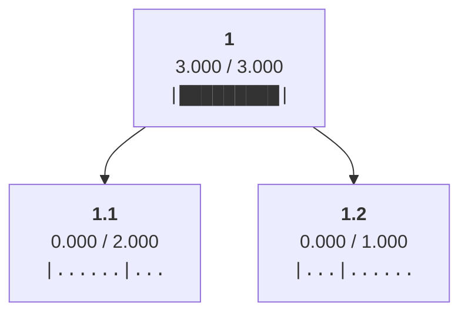
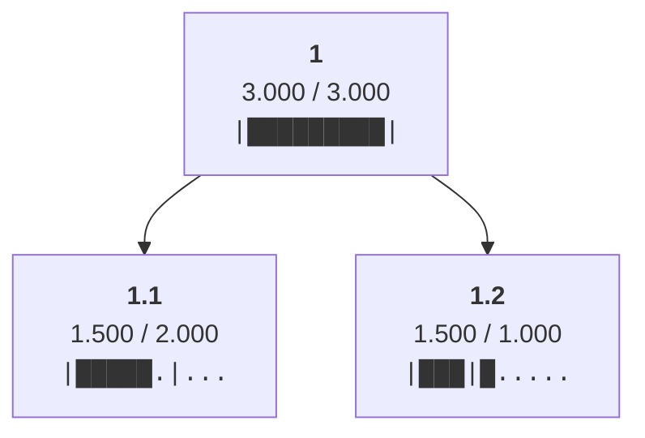

Allocated min(ancestral_budgets) = 2.0 to leaf 1.1

Allocated min(ancestral_budgets) = 1.0 to leaf 1.2

Cleared allocations from all non-root nodes

Distributed 3.0 from node 1 to children ['1.1', '1.2']

Redistributed 0.5 from node 1.2 to siblings with headroom ['1.1']

