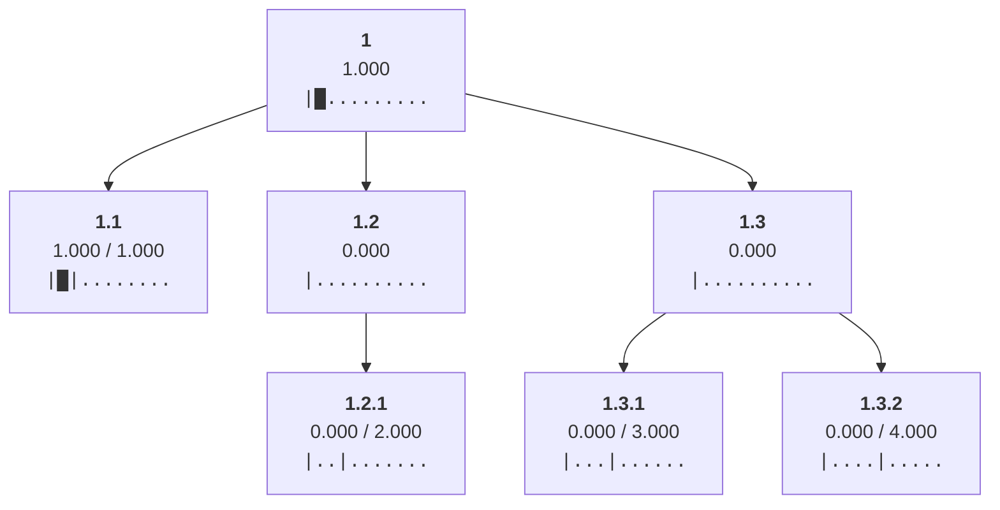
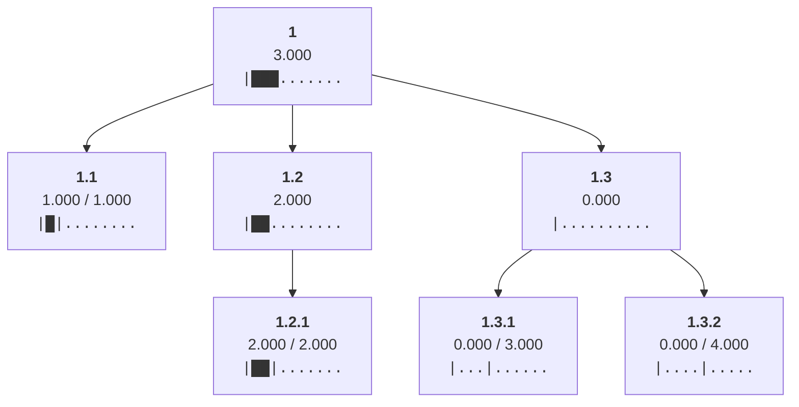
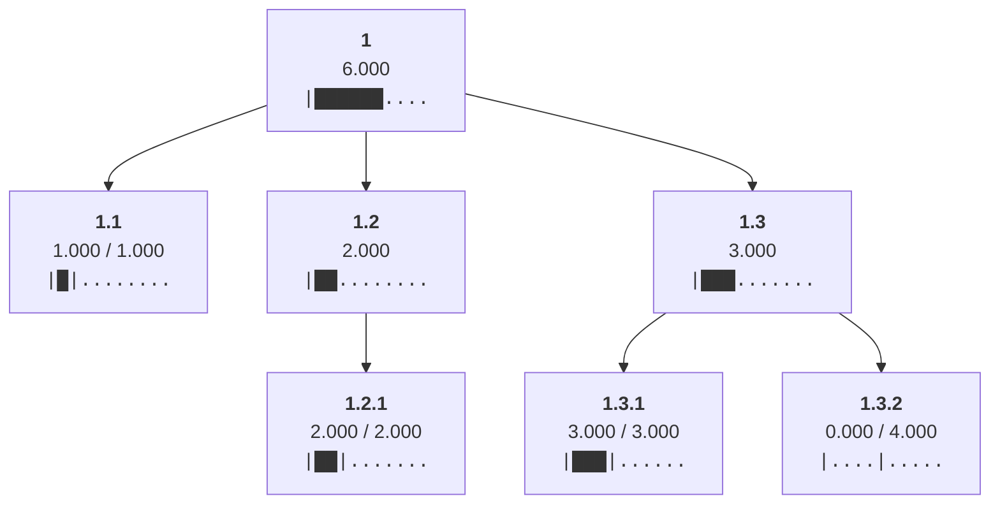
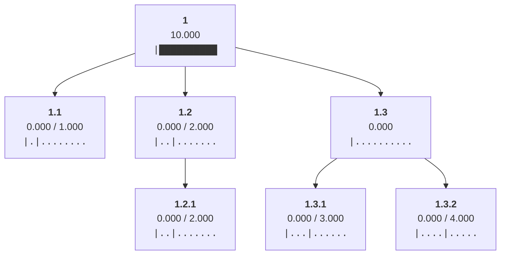
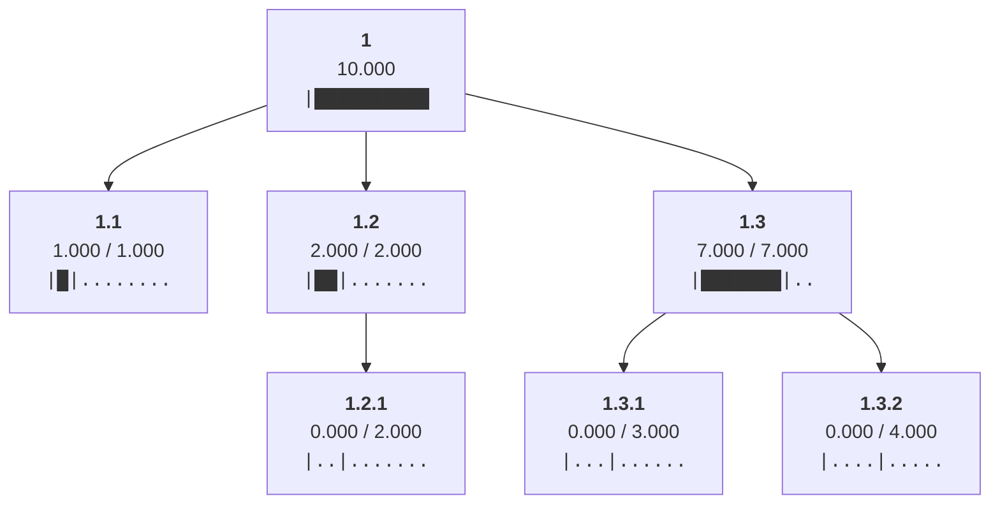
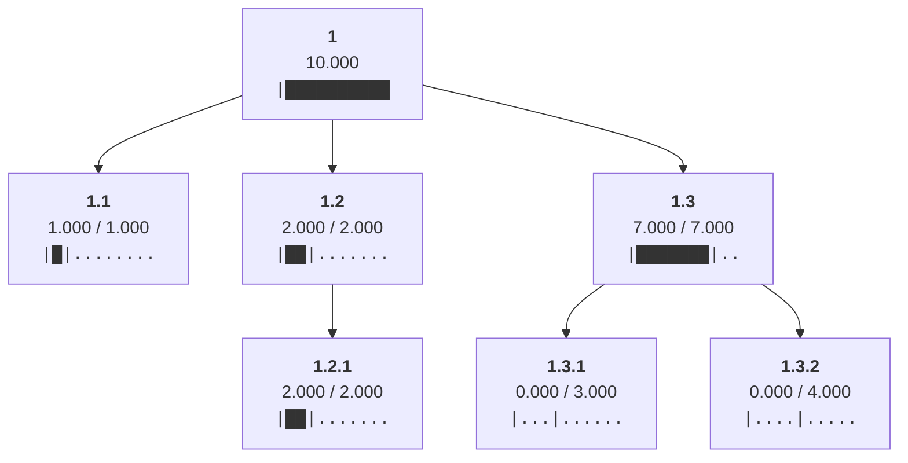
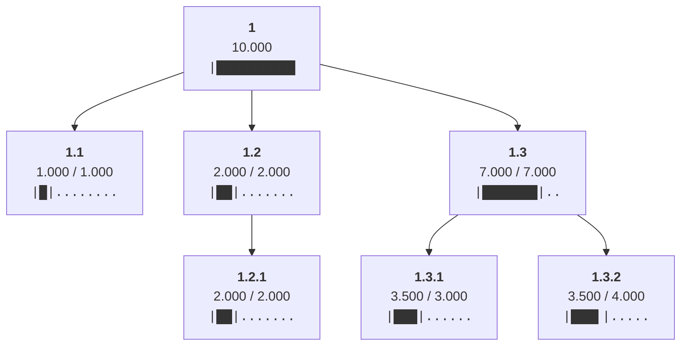

Allocated min(ancestral_budgets) = 1.0 to leaf 1.1

Allocated min(ancestral_budgets) = 2.0 to leaf 1.2.1

Allocated min(ancestral_budgets) = 3.0 to leaf 1.3.1

Allocated min(ancestral_budgets) = 4.0 to leaf 1.3.2

Cleared allocations from all non-root nodes

Set limit of node 1.2 to the sum of its children's limits 2

Set limit of node 1.3 to the sum of its children's limits 7

Distributed 10.0 from node 1 to children ['1.1', '1.2', '1.3']

Redistributed 1.5 from node 1.1 to siblings with headroom ['1.3']

Redistributed 0.5 from node 1.2 to siblings with headroom ['1.3']

Distributed 2.0 from node 1.2 to children ['1.2.1']

Distributed 7.0 from node 1.3 to children ['1.3.1', '1.3.2']

Redistributed 0.5 from node 1.3.1 to siblings with headroom ['1.3.2']

